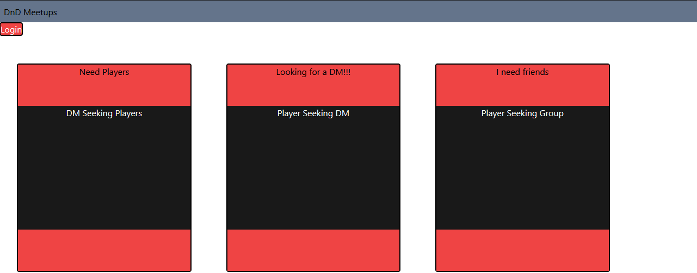

# DnDMeetups

## Description

DnD Meetups is an application designed for Dungeons and Dragons players to arrange meetings and form lasting friendships!

## Contributions

GitHub: bobefett-qwert12 (Ryan P), nookworth (Chris M), prohea (Hope Z)

## Technologies Used

Node.js, Express.js, Tailwind CSS, MySQL

## Deployed Project

[DnD Meetups Live](https://frozen-meadow-34344.herokuapp.com/)

## Screenshot

